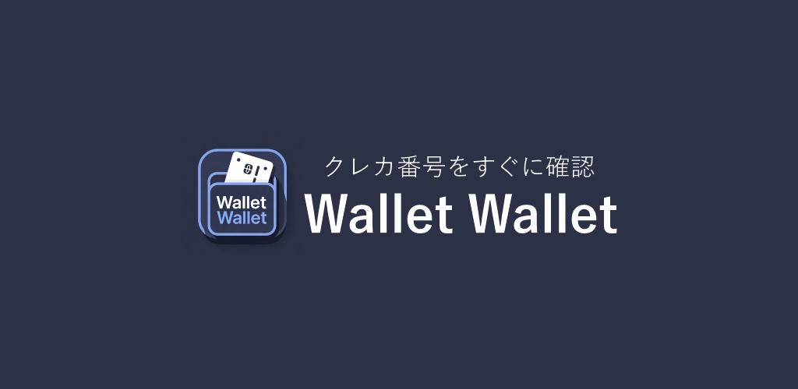

# Wallet Wallet

クレジットカード・銀行口座の番号を暗号化してローカルに安全管理するアプリ



- 🌐 ホームページ: <https://wallet.enoki.xyz>
- 📱 最新版 Android APK: [ダウンロード](https://raw.githubusercontent.com/jikantoki/wallet-wallet/refs/heads/main/app-release.apk)

## 概要

Wallet Wallet は、クレジットカードや銀行口座の情報を **AES 暗号化** してデバイスのローカルストレージに保存する管理アプリです。  
サーバーへのデータ送信は行わず、すべての情報はユーザーの端末内で完結します。

## 主な機能

- クレジットカード情報の登録・管理（カード番号、有効期限、CVC など）
- 銀行口座情報の登録・管理（銀行コード・支店コード・口座番号など）
- カード情報の QR コード表示
- 暗号化ファイルによる端末間データ転送（エクスポート / インポート）
- JSON 形式でのデータエクスポート / インポート
- バイオメトリクス認証（Android）
- ダークテーマ対応
- Android アプリ対応（Capacitor）

## 技術スタック

| カテゴリ       | 使用技術                                                      |
| -------------- | ------------------------------------------------------------- |
| フロントエンド | [Vue 3](https://v3.vuejs.org/) + [Vuetify 3](https://vuetifyjs.com/) |
| 言語           | TypeScript, Pug, SCSS                                         |
| ビルドツール   | [Vite](https://vitejs.dev/)                                   |
| 状態管理       | [Pinia](https://pinia.vuejs.org/) + pinia-plugin-persistedstate |
| ルーティング   | [Vue Router](https://router.vuejs.org/) (unplugin-vue-router) |
| 暗号化         | [secure-ls](https://github.com/softvar/secure-ls) (AES)       |
| モバイルアプリ | [Capacitor](https://capacitorjs.com/) (Android)               |
| バックエンド   | PHP + MySQL（アカウント機能・プッシュ通知などオプション機能用）|

## 前提条件

- Node.js（推奨: v22 以上）
- yarn

## セットアップ

### 1. 依存関係のインストール

```shell
yarn install
```

### 2. .env ファイルの設定

ローカルストレージの暗号化に使用するパスワードを設定します。  
リポジトリルートに `.env` ファイルを作成してください。

```env
localStorageKey=ローカルストレージを暗号化するパスワード
```

### 3. 開発サーバーの起動

```shell
yarn dev
```

開発サーバーは <http://localhost:8990> で起動します。

### 4. 本番ビルド

```shell
yarn build
```

### 5. リントの実行

```shell
yarn lint
```

## ファイル構成

```
wallet-wallet/
├── src/
│   ├── pages/          # ページコンポーネント（unplugin-vue-router で自動ルーティング）
│   ├── components/     # 共通コンポーネント
│   ├── js/             # ユーティリティ関数（暗号化・Ajax など）
│   ├── stores/         # Pinia ストア（カード・設定データの永続化）
│   ├── mixins/         # Vue ミックスイン
│   ├── styles/         # グローバル SCSS ファイル
│   ├── plugins/        # Vuetify などのプラグイン設定
│   └── router/         # Vue Router 設定
├── php/                # バックエンド PHP（アカウント機能・プッシュ通知用）
├── android/            # Capacitor Android プロジェクト
├── public/             # 静的ファイル
├── capacitor.config.ts # Capacitor 設定
├── vite.config.mts     # Vite 設定
└── database.sql        # MySQL テーブル定義
```

## ページ構成

| パス                    | 説明                           |
| ----------------------- | ------------------------------ |
| `/`                     | カード・銀行口座一覧（トップ） |
| `/create`               | クレジットカード新規登録       |
| `/createBank`           | 銀行口座新規登録               |
| `/edit/:id`             | クレジットカード編集           |
| `/editBank/:id`         | 銀行口座編集                   |
| `/qrcode`               | QR コード表示                  |
| `/data-export`          | データエクスポート             |
| `/data-import`          | データインポート               |
| `/settings`             | 設定トップ                     |
| `/settings/display`     | 外観設定（テーマ・言語）       |
| `/settings/profile`     | プロフィール設定               |
| `/friendlist`           | 友達リスト                     |
| `/user/:userId`         | ユーザープロフィール表示       |
| `/login`                | ログイン                       |
| `/registar`             | アカウント登録                 |
| `/about`                | このアプリについて             |
| `/terms`                | 利用規約                       |
| `/tutorial`             | チュートリアル                 |

## データ転送機能

暗号化ファイル + パスワードで他の端末にデータを転送できます。

### 使い方

1. **エクスポート（転送元の端末）**
   - 設定 → データエクスポート
   - 8 文字以上のパスワードを設定
   - パスワード確認を入力
   - 「ファイルを保存」ボタンをクリック
   - ファイルを共有、またはクリップボードにコピー

2. **インポート（転送先の端末）**
   - 設定 → データインポート
   - ファイルを選択、またはクリップボードから貼り付け
   - エクスポート時に設定したパスワードを入力
   - 「データをインポート」ボタンをクリック
   - インポート完了後、データが上書きされます

### セキュリティ

- データは AES 暗号化されてファイルに保存されます
- パスワードを知っている人のみがデータを復号できます
- パスワードは 8 文字以上必須です
- データの整合性と形式を厳密に検証します

### 注意事項

- インポートすると既存のカードと銀行口座データが上書きされます
- パスワードを忘れるとデータを復号できません
- ファイルは安全な方法で転送してください（メール、メッセージアプリなど）

## PHP バックエンド（オプション）

アカウント機能・プッシュ通知・友達リストなどのサーバーサイド機能を使用する場合は PHP サーバーが必要です。  
クレジットカード情報の管理のみを使用する場合は不要です。

### セットアップ

1. PHP と Composer をインストール
2. `composer install` を実行（リポジトリルートで）
3. リポジトリルート直下に `env.php` を作成し、以下を記述

```php
<?php
define('DIRECTORY_NAME', '/プロジェクトルートのディレクトリ名');

define('VUE_APP_WebPush_PublicKey', 'パブリックキー');
define('VUE_APP_WebPush_PrivateKey', 'プライベートキー');
define('WebPush_URL', 'プッシュ通知を使うドメイン');
define('WebPush_icon', 'プッシュ通知アイコンのURL');
define('Default_user_icon', 'アイコン未設定アカウント用の初期アイコンURL');

define('MySQL_Host', 'MySQLサーバー');
define('MySQL_DBName', 'DB名');
define('MySQL_User', 'DB操作ユーザー名');
define('MySQL_Password', 'DBパスワード');

define('SMTP_Name', '自動メール送信時の差出名');
define('SMTP_Username', 'SMTPユーザー名');
define('SMTP_Mailaddress', '送信に使うメールアドレス');
define('SMTP_Password', 'SMTPパスワード');
define('SMTP_Server', 'SMTPサーバー');
define('SMTP_Port', 587);
```

4. `database.sql` を MySQL にインポート
5. `/makeApiForAdmin.php` にアクセスして API トークンを発行し、`.env` に記述

```env
VUE_APP_API_ID=default
VUE_APP_API_TOKEN=発行されたアクセストークン
VUE_APP_API_ACCESSKEY=発行されたアクセスキー
VUE_APP_API_HOST=APIサーバーのホスト
```

## Android アプリのビルド

```shell
yarn build
npx cap sync android
# Android Studio で android/ フォルダを開いてビルド
```

## 📑 ライセンス

[MIT](http://opensource.org/licenses/MIT)

Copyright (c) 2019-present エノキ電気
